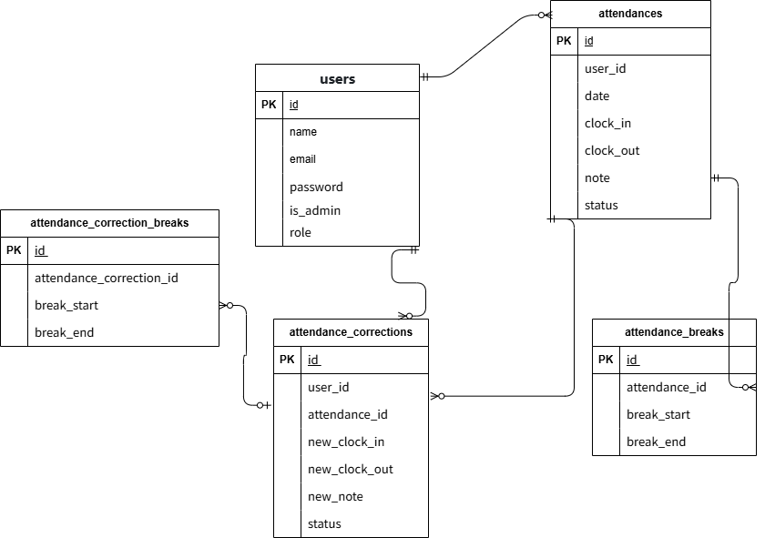

環境構築

Dockerビルド

・git clone git@github.com:qliangtai34/Attendance.git ・docker-compose up -d --build

Laravel環境構築

・docker-compose exec php bash ・composer install ・.env.exampleファイルから.envを作成し、環境変数を変更 ・php artisan key:generate ・php artisan migrate ・php artisan db:seed

開発環境

・一覧画面：http://localhost/ ・ユーザー登録：http://localhost/register ・phpMyAdmin：http://localhost:8080/index.php

使用技術（実行環境）

・PHP 7.4.9 ・Laravel 8.83.29 ・MySQL 15.1 ・nginx　1.21.1

・ER図
